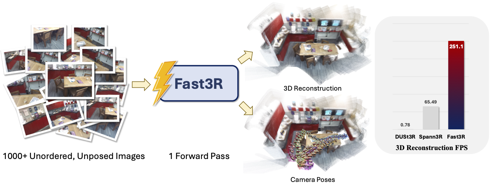

<div align="center">

# ⚡️Fast3R: Towards 3D Reconstruction of 1000+ Images in One Forward Pass


${{\color{Red}\Huge{\textsf{  CVPR\ 2025\ \}}}}\$


[](https://arxiv.org/abs/2501.13928)
[](https://fast3r-3d.github.io/)
[](https://fast3r.ngrok.app/)
[](https://huggingface.co/jedyang97/Fast3R_ViT_Large_512/)
</div>



Official implementation of **Fast3R: Towards 3D Reconstruction of 1000+ Images in One Forward Pass**, CVPR 2025

*[Jianing Yang](https://jedyang.com/), [Alexander Sax](https://alexsax.github.io/), [Kevin J. Liang](https://kevinjliang.github.io/), [Mikael Henaff](https://www.mikaelhenaff.net/), [Hao Tang](https://tanghaotommy.github.io/), [Ang Cao](https://caoang327.github.io/), [Joyce Chai](https://web.eecs.umich.edu/~chaijy/), [Franziska Meier](https://fmeier.github.io/), [Matt Feiszli](https://www.linkedin.com/in/matt-feiszli-76b34b/)*

## Installation

```bash
# clone project
git clone https://github.com/facebookresearch/fast3r
cd fast3r

# create conda environment
conda create -n fast3r python=3.11 cmake=3.14.0 -y
conda activate fast3r

# install PyTorch (adjust cuda version according to your system)
conda install pytorch torchvision torchaudio pytorch-cuda=12.4 nvidia/label/cuda-12.4.0::cuda-toolkit -c pytorch -c nvidia

# install PyTorch3D from source (the compilation will take a while)
pip install "git+https://github.com/facebookresearch/pytorch3d.git@stable"

# install requirements
pip install -r requirements.txt

# install fast3r as a package (so you can import fast3r and use it in your own project)
pip install -e .
```

<details>
<summary>Installation Troubleshooting</summary>

If you encounter the error `fatal error: cuda_runtime.h: No such file or directory` when installing PyTorch3D, try setting `CUDA_HOME` before installing PyTorch3D:

```bash
export CUDA_HOME=/usr/local/cuda-12.4
pip install "git+https://github.com/facebookresearch/pytorch3d.git@stable"
```
</details>

## Demo

Use the following command to run the demo:

```bash
python fast3r/viz/demo.py
```
This will automatically download the pre-trained model weights and config from [Hugging Face Model](https://huggingface.co/jedyang97/Fast3R_ViT_Large_512).

The demo is a Gradio interface where you can upload images or a video and visualize the 3D reconstruction and camera pose estimation.

`fast3r/viz/demo.py` also serves as an example of how to use the model for inference.

<div>
  
  
  <br>
  <em>Left: Upload a video. Right: Visualize the 3D Reconstruction</em>
</div>

<details>
<summary>Click here to see example of: visualize confidence heatmap + play frame by frame + render a GIF</summary>
<div style="display: flex; justify-content: center;">
  
</div>
</details>

## Using Fast3R in Your Own Project

To use Fast3R in your own project, you can import the `Fast3R` class from `fast3r.models.fast3r` and use it as a regular PyTorch model.

```python
from fast3r.models.fast3r import Fast3R

# Load the model from Hugging Face
model = Fast3R.from_pretrained("jedyang97/Fast3R_ViT_Large_512")
model = model.to("cuda")

# [Optional] Create a lightweight lightning module wrapper for the model.
# This provides functions to estimate camera poses, evaluate 3D reconstruction, etc.
# See fast3r/viz/demo.py for an example.
lit_module = MultiViewDUSt3RLitModule.load_for_inference(model)

# Set model to evaluation mode
model.eval()
lit_module.eval()
```

## Training

Train model with chosen experiment configuration from [configs/experiment/](configs/experiment/)

```bash
python fast3r/train.py experiment=super_long_training/super_long_training
```

You can override any parameter from command line following [Hydra override syntax](https://hydra.cc/docs/advanced/override_grammar/basic/):

```bash
python fast3r/train.py experiment=super_long_training/super_long_training trainer.max_epochs=20 trainer.num_nodes=2
```

To submit a multi-node training job with Slurm, use the following command:

```bash
python scripts/slurm/submit_train.py --nodes=<NODES> --experiment=<EXPERIMENT>
```

## Evaluation

To evaluate on 3D reconstruction or camera pose estimation tasks, run:

```bash
python fast3r/evaluate.py eval=<eval_config>
```
`<eval_config>` can be any of the evaluation configurations in [configs/eval/](configs/eval/). For example:
- `ablation_recon_better_inference_hp/ablation_recon_better_inference_hp` evaluates the 3D reconstruction on DTU, 7-Scenes and Neural-RGBD datasets.
- `eval_cam_pose/eval_cam_pose_10views` evaluates the camera pose estimation on 10 views on CO3D dataset.


To evaluate camera poses on RealEstate10K dataset, run:

```bash
python scripts/fast3r_re10k_pose_eval.py  --subset_file scripts/re10k_test_1800.txt
```

To evaluate multi-view depth estimation on Tanks and Temples, ETH-3D, DTU and ScanNet datasets, follow the data download and preparation guide of [robustmvd](https://github.com/lmb-freiburg/robustmvd), install that repo's `requirements.txt` into the current conda environment, and run:

```bash
python scripts/robustmvd_eval.py
```

## License

The code and models are licensed under the [CC BY-NC-SA 4.0 license](LICENSE).

## Contributing

See [contributing](CONTRIBUTING.md) and the [code of conduct](CODE_OF_CONDUCT.md).

## Citation

```
@InProceedings{Yang_2025_Fast3R,
    title={Fast3R: Towards 3D Reconstruction of 1000+ Images in One Forward Pass},
    author={Jianing Yang and Alexander Sax and Kevin J. Liang and Mikael Henaff and Hao Tang and Ang Cao and Joyce Chai and Franziska Meier and Matt Feiszli},
    booktitle={Proceedings of the IEEE/CVF Conference on Computer Vision and Pattern Recognition (CVPR)},
    month={June},
    year={2025},
}
```

## Acknowledgement

Fast3R is built upon a foundation of remarkable open-source projects. We deeply appreciate the contributions of these projects and their communities, whose efforts have significantly advanced the field and made this work possible.

- [DUSt3R](https://dust3r.europe.naverlabs.com/)
- [Spann3R](https://hengyiwang.github.io/projects/spanner)
- [Viser](https://viser.studio/main/)
- [Lightning-Hydra-Template](https://github.com/ashleve/lightning-hydra-template)
